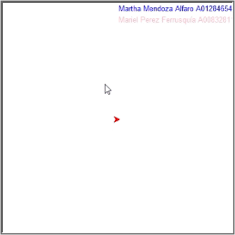

## Actividad 2 - Modificación del Juego de Paint
# SemanaTecTC1001S-101
# Autores
- Martha Mendoza Alfaro A01284654
- Mariel Perez Ferrusquía A00832811

# Funciones agregadas
def info_alumnos()
- Despliega la información del equipo
- Autor: Martha Mendoza
- Código:

```python
def info_alumnos():
    writer.up()
    writer.goto(0,190)
    writer.color('blue')
    writer.write('Martha Mendoza Alfaro A01284654', align = 'left', font = ('Arial',10,'normal'))
    writer.goto(0,170)
    writer.color('pink')
    writer.write('Mariel Perez Ferrusquía A00832811', align = 'left', font = ('Arial',10,'normal'))
```

def circle2()
- Dibuja un círculo
- Autor: Mariel Perez
- Código: 

```python
def circle2(start, end):
    """Draw circle from start to end."""
    up()
    goto(start.x, start.y)
    down()
    r = start.x - end.x
    begin_fill()
    circle(r)
    end_fill()
```

def rectangle()
- Dibuja un rectángulo
- Autor: Mariel Perez
- Código:

```python
def rectangle(start, end):
    """Draw rectangle from start to end."""
    up()
    goto(start.x, start.y)
    down()
    #rellena el square
    begin_fill()

    for count in range(2):
        forward(end.x - start.x)
        left(90)
        forward(end.y - start.y)
        left(90)

    end_fill()
```

def triangle()
- Dibuja un triángulo
- Autor: Martha Mendoza
- Código:

```python
def triangle(start, end):
    """Draw triangle from start to end."""
    up()
    goto(start.x, start.y)
    down()
    #rellena el triangulo
    begin_fill()

    for count in range(3):
        forward(end.x - start.x)
        left(120)

    end_fill()
```


