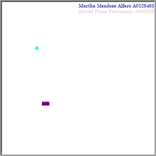

## Actividad 3 - Modificación del Juego de Snake
# SemanaTecTC1001S-101
# Autores
- Martha Mendoza Alfaro A01284654
- Mariel Perez Ferrusquía A00832811

# Funciones agregadas
def info_alumnos()
- Despliega la información del equipo
- Autor: Mariel Perez
- Código:

```python
def info_alumnos():
    color('purple')
    writer.hideturtle()
    writer.up()
    writer.goto(0,190)
    writer.color('blue')
    writer.write('Martha Mendoza Alfaro A01284654', align = 'left', font = ('Century',10,'normal'))
    writer.goto(0,175)
    writer.color('pink')
    writer.write('Mariel Perez Ferrusquía A00832811', align = 'left', font = ('Century',10,'normal'))
```

Primer cambio en move()
- Verifica los movimientos que ha realizado la serpiente y mueve la ubicacion de la comida.
- Autor: Mariel Perez
- Código:

```python
    global contador
    contador += 1
    head = snake[-1].copy()
    head.move(aim)
    
    if contador > 9:
        movimiento = choice(lista_mov_food)
        food_aux = food.copy()
        food_aux.move(movimiento)

        if not inside(food_aux) or food_aux in snake:
            movimiento = choice(lista_mov_food)
            food_aux.move(movimiento)

        foodCircle.clear()
        food.move(movimiento)
        contador = 0
        update()
```

Segundo cambio en move()
- Cambia la forma de la comida
- Autor: Martha Mendoza
- Código:

```python
    foodCircle.up()
    xCircle = food.x + 4.5
    yCircle = food.y + 4.5
    foodCircle.setpos(xCircle, yCircle)
    color = foodCircle.pencolor()
    foodCircle.dot(9, color)
```

Tercer cambio en move()
- Cambia los colores de la serpiente y la comida
- Autor: Martha Mendoza
- Código:

```python
foodCircle = Turtle(visible=False)
foodCircle.pencolor("purple")

snakeSquare = Turtle(visible=False)
snakeSquare.pencolor("black")
```

```python
if head == food:
    print('Snake:', len(snake))
    food.x = randrange(-15, 15) * 10
    food.y = randrange(-15, 15) * 10
    foodCircle.clear()
    colorFood = choice(colores)
    colorSnake = choice(colores)
    snakeSquare.pencolor(colorSnake)
    foodCircle.pencolor(colorFood)
```

